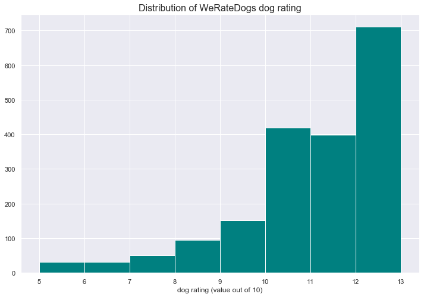
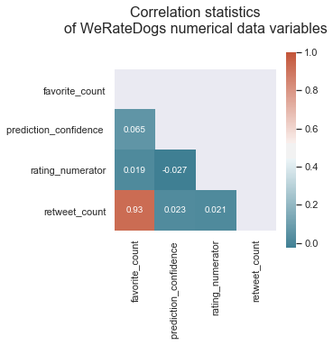
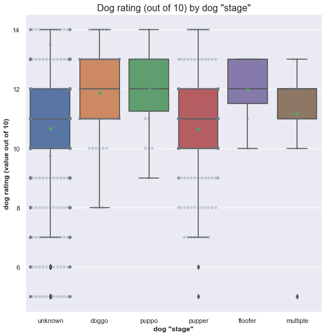
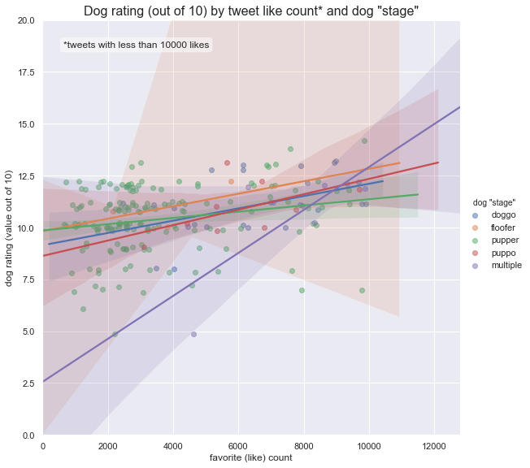
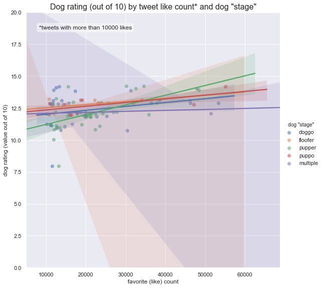
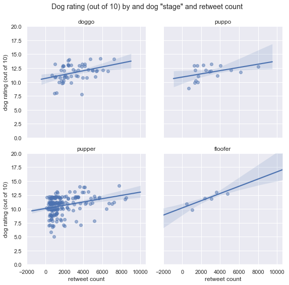
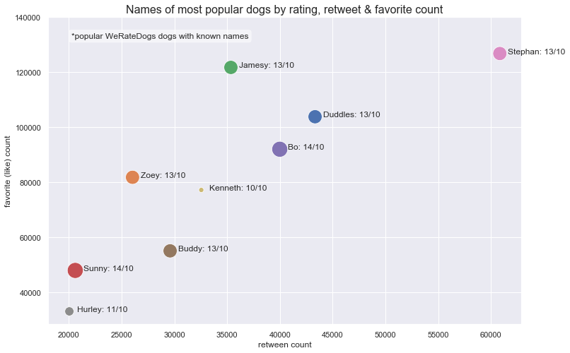
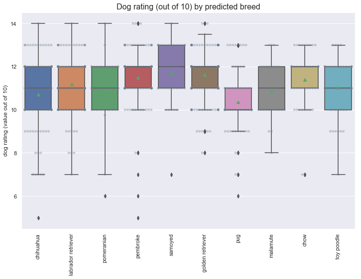
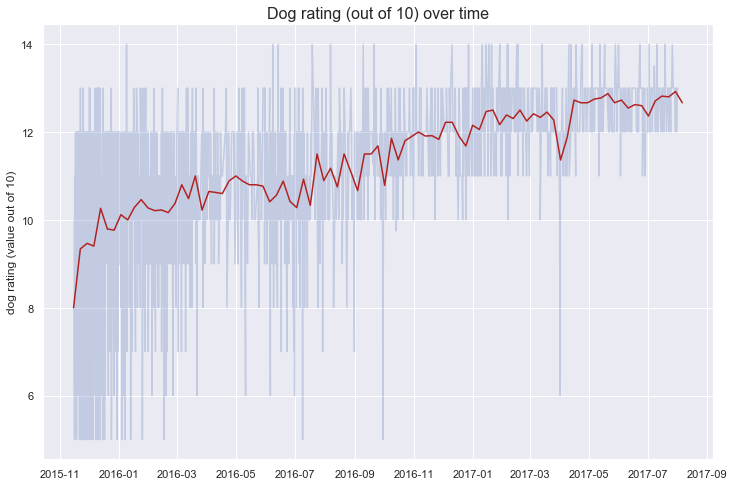

# Wrangling and Analyzing WeRateDogs Data

Wrangle WeRateDogs Twitter data to create interesting and trustworthy analyses and visualizations.

### Introduction into the dataset

1. The WeRateDogs Twitter archive. One column of the archive does contain: each tweet's text, dog name, and dog "stage" (i.e. doggo, floofer, pupper, and puppo). Of the 5000+ tweets, tweets are filtered with ratings only (there are 2356).

2. The tweet image predictions, i.e., what breed of dog (or other object, animal, etc.) is present in each tweet according to a neural network (to be downloaded programmatically using the Requests library).

3. Each tweet's retweet count and favorite ("like") count (to be gathered programmatically via Twitter API).

# Step 1. Data collection

*Full code available at [analyzing_weratedogs.ipynb](https://github.com/evanca/data-analysis_python_weratedogs-wrangling/blob/master/analyzing_weratedogs.ipynb)*

# Step 2. Data assessment

Dogs are rated on a scale of one to ten, but are invariably given ratings in excess of the maximum, such as "13/10" (source: https://en.wikipedia.org/wiki/WeRateDogs)

### Data tidiness checklist:

- [ ] Each variable forms a column - NO: "dog stages" form 4 columns instead of one
- [x] Each observation forms a row - YES
- [ ] Each type of observational unit forms a table - NO: we should merge all data into one table

### Data quality issues (from visual assessment):

- [ ] "None" string instead of np.nan in dog stages
- [ ] We only want original tweets (no retweets)
- [ ] Unnecessary columns containing retweeted status info & "in reply to" info 
- [ ] Incorrect rating values
- [ ] We only want tweets with ratings
- [ ] We only want tweets that have images
- [ ] Incorrect or missing names
- [ ] Multiple breeds in the predictions table
- [ ] Uninformative column names in the predictions table
- [ ] Incorrect type for timestamp
- [ ] Null objects

*Full code available at [analyzing_weratedogs.ipynb](https://github.com/evanca/data-analysis_python_weratedogs-wrangling/blob/master/analyzing_weratedogs.ipynb)*

# Step 3. Programmatic data cleaning

*Full code available at [analyzing_weratedogs.ipynb](https://github.com/evanca/data-analysis_python_weratedogs-wrangling/blob/master/analyzing_weratedogs.ipynb)*

# Step 4. Analyzing and visualizing data

### Main feature of interest
Main feature of interest in our dataset is the **dog rating out of 10**:


```python
print(list(twitter_df_clean))
```

    ['tweet_id', 'timestamp', 'source', 'text', 'expanded_urls', 'rating_numerator', 'rating_denominator', 'name', 'dog_stage', 'full_rating', 'retweet_count', 'favorite_count', 'jpg_url', 'img_num', 'predicted_breed', 'prediction_confidence ']
    


```python
twitter_df_clean.rating_numerator.describe()
```


    count    1930.000000
    mean       11.878124
    std        41.282528
    min         5.000000
    25%        10.000000
    50%        11.000000
    75%        12.000000
    max      1776.000000
    Name: rating_numerator, dtype: float64


For a histogram, we will **get rid of outliers** based on a 99% of dog ratings.


```python
plt.figure(figsize=(12,8))
plt.hist(twitter_df_clean['rating_numerator'], bins=np.arange(min(twitter_df_clean['rating_numerator']), twitter_df_clean.rating_numerator.quantile(.99), 1), color="teal")
plt.title('Distribution of WeRateDogs dog rating', fontsize=16)
plt.xlabel('dog rating (value out of 10)')
plt.show()
```





**Insights:** Dog rating distribution is left skewed. Most of the values are between 5/10 and 13/10, with a median (from the earlier summary) of 11/10 and a mean of 12/10.

### Exploring correlations between numerical variables


```python
f, ax = plt.subplots(figsize=(4, 4))

# Remove the 'tweet_id' column, as it is stored as integer
# Remove the 'rating denominator' column, as it is always "10"
corr = twitter_df_clean[twitter_df_clean.columns.difference(['tweet_id', 'rating_denominator', 'img_num'])].corr()

mask = np.zeros_like(corr, dtype=np.bool)
mask[np.triu_indices_from(mask)] = True

sns.heatmap(corr, mask=mask,
            cmap=sns.diverging_palette(220, 20, sep=20, as_cmap=True),
            square=True, ax=ax,
            annot=True, annot_kws={"size": 10})


plt.title('Correlation statistics\nof WeRateDogs numerical data variables\n\n', fontsize=16)
plt.show()
```





Correlation coefficient interpretation:

1 (-1) - Perfect linear relationship<br>
0.70 (-0.70) - Strong linear relationship<br>
0.50 (-0.50) - Moderate relationship<br>
0.30 (-0.30) - Weak linear relationship<br>
0 - No linear relationship

**Insights:** There is a reasonable positive correlation between favorite count and retweet count. As for the dog rating numerator, we don't observe any correlation between rating and favorite / retweet count. Breed prediction confidence value also didn't show any linear relationships, which understandably means that it is not influenced by other numerical variables.

### Multivariate analysis


```python
# Remove extreme outliers that will make plots uninformative:

df = twitter_df_clean.copy()
df = df[df.rating_numerator < 100]

df.rating_numerator.describe()
```


    count    1928.000000
    mean       10.751442
    std         1.816124
    min         5.000000
    25%        10.000000
    50%        11.000000
    75%        12.000000
    max        14.000000
    Name: rating_numerator, dtype: float64


```python
plt.figure(figsize=(8,8))
sns.boxplot(x="dog_stage", y="rating_numerator", data=df, showmeans=True)
sns.swarmplot(x="dog_stage", y="rating_numerator", data=df, color="slategrey", alpha=.35)

plt.tight_layout(pad=1.4)
plt.ylabel('dog rating (value out of 10)', fontweight='bold')
plt.xlabel('dog "stage"', fontweight='bold')
plt.title('Dog rating (out of 10) by dog "stage"', fontsize=16)
plt.show()
```





```python
df.groupby('dog_stage', as_index=False)['rating_numerator'].mean()
```


<div>
<style scoped>
    .dataframe tbody tr th:only-of-type {
        vertical-align: middle;
    }

    .dataframe tbody tr th {
        vertical-align: top;
    }

    .dataframe thead th {
        text-align: right;
    }
</style>
<table border="1" class="dataframe">
  <thead>
    <tr style="text-align: right;">
      <th></th>
      <th>dog_stage</th>
      <th>rating_numerator</th>
    </tr>
  </thead>
  <tbody>
    <tr>
      <th>0</th>
      <td>doggo</td>
      <td>11.888889</td>
    </tr>
    <tr>
      <th>1</th>
      <td>floofer</td>
      <td>12.000000</td>
    </tr>
    <tr>
      <th>2</th>
      <td>multiple</td>
      <td>11.181818</td>
    </tr>
    <tr>
      <th>3</th>
      <td>pupper</td>
      <td>10.674604</td>
    </tr>
    <tr>
      <th>4</th>
      <td>puppo</td>
      <td>12.000000</td>
    </tr>
    <tr>
      <th>5</th>
      <td>unknown</td>
      <td>10.691627</td>
    </tr>
  </tbody>
</table>
</div>


**Insights:** Dogs in a "puppo" stage seem to receive higher ratings (mean value of 12/10) compared to other stages.


```python
df.dog_stage.value_counts()
```


    unknown     1623
    pupper       202
    doggo         63
    puppo         22
    multiple      11
    floofer        7
    Name: dog_stage, dtype: int64


```python
df.favorite_count.describe()
```


    count      1928.000000
    mean       8879.376037
    std       12933.864381
    min          78.000000
    25%        1940.500000
    50%        4009.000000
    75%       11066.500000
    max      163997.000000
    Name: favorite_count, dtype: float64


```python
g = sns.lmplot(x='favorite_count',
           y='rating_numerator',
           hue='dog_stage',
               hue_order = ['doggo', 'floofer', 'pupper', 'puppo', 'multiple'],
           data=df[(df.favorite_count < 10000) &
                   (df.dog_stage != "unknown")],
           height = 8,
           fit_reg=True,
           x_jitter=0.25,
           y_jitter=0.25,
           scatter_kws={'alpha': 0.5})
g.set(xlim=(0, None))
g.set(ylim=(0, 20))

g._legend.set_title('dog "stage"')

ax = plt.gca()
ax.set_ylabel('dog rating (value out of 10)')
ax.set_xlabel('favorite (like) count')
ax.set_title('Dog rating (out of 10) by tweet like count* and dog "stage"', fontsize=16)

props = dict(boxstyle='round', facecolor='white', alpha=0.5)
ax.text(0.05, 0.95, '*tweets with less than 10000 likes', transform=ax.transAxes, fontsize=12,
        verticalalignment='top', bbox=props)
```


    Text(0.05,0.95,'*tweets with less than 10000 likes')





**Insights:** We observe a strong linear relationship of the like count and rating for the dogs with multiple dog stages, but we can't confirm the correlation with only 11 data points. There is a positive correlation of the like count and rating for the "puppo" and "doggo". For other dog stages, either data points are spread out or we don't have enough data to confirm any trends (for tweets with less than 10000 likes).


```python
g = sns.lmplot(x='favorite_count',
           y='rating_numerator',
           hue='dog_stage',
               hue_order = ['doggo', 'floofer', 'pupper', 'puppo', 'multiple'],
           data=df[(df.favorite_count >= 10000) &
                   (df.favorite_count < df.favorite_count.quantile(.99)) &
                   (df.dog_stage != "unknown")],
           height = 8,
           fit_reg=True,
           x_jitter=0.25,
           y_jitter=0.25,
           scatter_kws={'alpha': 0.5})
g.set(xlim=(5000, None))
g.set(ylim=(0, 20))

g._legend.set_title('dog "stage"')

ax = plt.gca()
ax.set_ylabel('dog rating (value out of 10)')
ax.set_xlabel('favorite (like) count')
ax.set_title('Dog rating (out of 10) by tweet like count* and dog "stage"', fontsize=16)

props = dict(boxstyle='round', facecolor='white', alpha=0.5)
ax.text(0.05, 0.95, '*tweets with more than 10000 likes', transform=ax.transAxes, fontsize=12,
        verticalalignment='top', bbox=props)
```


    Text(0.05,0.95,'*tweets with more than 10000 likes')





**Insights:** If tweet has more than 10000 likes, it is unlikely for a dog rating to be lower than 10. There is a moderate positive correlation of the like count and rating for the "puppo" and "pupper" dogs. 


```python
g = sns.lmplot(x='retweet_count',
           y='rating_numerator',
           col ='dog_stage',
           col_wrap = 2,
           data=df[(df.retweet_count < df.retweet_count.quantile(.95)) &
                   (df.dog_stage != "unknown") &
                   (df.dog_stage != "multiple")],
           height = 4,
           fit_reg=True,
           x_jitter=0.25,
           y_jitter=0.25,
           scatter_kws={'alpha': 0.5})

g = (g.set_axis_labels("retweet count", "dog rating (out of 10)"))

g.set(ylim=(0, 20))

axes = g.axes.flatten()
axes[0].set_title("doggo")
axes[1].set_title("puppo")
axes[2].set_title("pupper")
axes[3].set_title("floofer")

plt.subplots_adjust(top=0.9)
g.fig.suptitle('Dog rating (out of 10) by and dog "stage" and retweet count')
```


    Text(0.5,0.98,'Dog rating (out of 10) by and dog "stage" and retweet count')





```python
df.loc[(df.dog_stage != "unknown")]['retweet_count'].corr(
    df.loc[(df.dog_stage != "unknown")]['rating_numerator'])
```


    0.33643629750274257


**Insights:** We see a slight positive relationship of the retweet count and rating for all dog stages. We could assume a stronger correlation for the "floofer" dogs, but we would need more data points to confirm that.


```python
plot = sns.scatterplot(x='retweet_count',
                y='favorite_count',
                hue='name',
                size='rating_numerator',
                sizes=(50, 500),
                legend=False,
                data=df[(df.retweet_count > df.retweet_count.quantile(.99)) &
                   (df.name != "")])

# Add annotation to each point:
for index in df[(df.retweet_count > df.retweet_count.quantile(.99)) &
                   (df.name != "")].index:
     plot.text(df.retweet_count[index]+750, df.favorite_count[index],
             (df.name[index] + ": " + str(df.full_rating[index])),
             horizontalalignment='left', size='medium')

ax = plt.gca()
ax.set_ylabel('favorite (like) count')
ax.set_xlabel('retween count')
ax.set_title('Names of most popular dogs by rating, retweet & favorite count', fontsize=16)

ax.set_ylim(None, 140000)

props = dict(boxstyle='round', facecolor='white', alpha=0.5)
ax.text(0.05, 0.95, '*popular WeRateDogs dogs with known names', transform=ax.transAxes, fontsize=12,
        verticalalignment='top', bbox=props)
```


    Text(0.05,0.95,'*popular WeRateDogs dogs with known names')





```python
df.loc[df.name == 'Stephan'][['retweet_count', 'favorite_count']]
```


<div>
<style scoped>
    .dataframe tbody tr th:only-of-type {
        vertical-align: middle;
    }

    .dataframe tbody tr th {
        vertical-align: top;
    }

    .dataframe thead th {
        text-align: right;
    }
</style>
<table border="1" class="dataframe">
  <thead>
    <tr style="text-align: right;">
      <th></th>
      <th>retweet_count</th>
      <th>favorite_count</th>
    </tr>
  </thead>
  <tbody>
    <tr>
      <th>397</th>
      <td>60845</td>
      <td>126815</td>
    </tr>
  </tbody>
</table>
</div>


**Insights:** After removing extreme outliers (e.g. Snoop Dogg), most popular dog (with a known name) is Stephan, with a rating of 13/10, 60845	retweets and 126815 likes.

Finding out top 10 predicted breeds:


```python
print(dict(twitter_df_clean.predicted_breed.value_counts().nlargest(11)).keys())
```

    dict_keys(['unknown', 'golden_retriever', 'labrador_retriever', 'pembroke', 'chihuahua', 'pug', 'toy_poodle', 'chow', 'pomeranian', 'samoyed', 'malamute'])
    


```python
top_breeds = ['golden_retriever', 'labrador_retriever', 'pembroke', 'chihuahua', 'pug',
              'toy_poodle', 'chow', 'pomeranian', 'samoyed', 'malamute']

plt.figure(figsize=(12,8))

data = twitter_df_clean[twitter_df_clean['predicted_breed'].isin(top_breeds)]

sns.boxplot(x="predicted_breed", y="rating_numerator", data=data, showmeans=True)
sns.swarmplot(x="predicted_breed", y="rating_numerator", data=data, color="slategrey", alpha=.35)

plt.xticks(rotation=90)

# Remove underscores from breed tick labels:
ax = plt.gca()
labels = [item.get_text() for item in ax.get_xticklabels()]
labels = [l.replace('_', ' ') for l in labels]
ax.set_xticklabels(labels)

plt.ylabel('dog rating (value out of 10)')
plt.xlabel('')

plt.title('Dog rating (out of 10) by predicted breed', fontsize=16)

plt.show()
```





```python
twitter_df_clean[twitter_df_clean['predicted_breed'].isin(top_breeds)].groupby('predicted_breed', as_index=False)['rating_numerator'].mean()
```


<div>
<style scoped>
    .dataframe tbody tr th:only-of-type {
        vertical-align: middle;
    }

    .dataframe tbody tr th {
        vertical-align: top;
    }

    .dataframe thead th {
        text-align: right;
    }
</style>
<table border="1" class="dataframe">
  <thead>
    <tr style="text-align: right;">
      <th></th>
      <th>predicted_breed</th>
      <th>rating_numerator</th>
    </tr>
  </thead>
  <tbody>
    <tr>
      <th>0</th>
      <td>chihuahua</td>
      <td>10.707865</td>
    </tr>
    <tr>
      <th>1</th>
      <td>chow</td>
      <td>11.404255</td>
    </tr>
    <tr>
      <th>2</th>
      <td>golden_retriever</td>
      <td>11.622581</td>
    </tr>
    <tr>
      <th>3</th>
      <td>labrador_retriever</td>
      <td>11.200000</td>
    </tr>
    <tr>
      <th>4</th>
      <td>malamute</td>
      <td>10.878788</td>
    </tr>
    <tr>
      <th>5</th>
      <td>pembroke</td>
      <td>11.489362</td>
    </tr>
    <tr>
      <th>6</th>
      <td>pomeranian</td>
      <td>10.922619</td>
    </tr>
    <tr>
      <th>7</th>
      <td>pug</td>
      <td>10.360656</td>
    </tr>
    <tr>
      <th>8</th>
      <td>samoyed</td>
      <td>11.731707</td>
    </tr>
    <tr>
      <th>9</th>
      <td>toy_poodle</td>
      <td>11.039216</td>
    </tr>
  </tbody>
</table>
</div>


**Insights:** Out of 10 most popular breeds in our dataset, pugs seem to receive lower ratings (mean value of 10.36/10) and samoyed higher ratings (mean value of 11.73/10).


```python
df.timestamp.describe()
```


    count                    1928
    unique                   1928
    top       2016-08-04 22:52:29
    freq                        1
    first     2015-11-15 22:32:08
    last      2017-08-01 16:23:56
    Name: timestamp, dtype: object


There are different 2051 timestamp values in our dataframe. Plotting all of them will make a lot of noise.

**Resampling timestamp data by week to make a smoother line plot:**


```python
copy = df[['timestamp','rating_numerator']].copy()
copy.set_index('timestamp', inplace=True)

resampled_df = pd.DataFrame()
resampled_df['rating'] = copy.rating_numerator.resample('W').mean()

resampled_df.info()
```

    <class 'pandas.core.frame.DataFrame'>
    DatetimeIndex: 91 entries, 2015-11-15 to 2017-08-06
    Freq: W-SUN
    Data columns (total 1 columns):
    rating    91 non-null float64
    dtypes: float64(1)
    memory usage: 1.4 KB
    


```python
plt.figure(figsize=(12,8))
plt.plot(copy, alpha = .25)
plt.plot(resampled_df, color = "firebrick")

plt.ylabel('dog rating (value out of 10)')
plt.title('Dog rating (out of 10) over time', fontsize=16)
plt.show()
```





**Insights:** Dog ratings are becoming higher over time (for tweets between November 2015 and August 2017).

### Reflection

- Dog rating distribution is left skewed. Most of the values are between 5/10 and 13/10, with a median of 11/10 and a mean of 12/10.
- Dogs in a "puppo" stage seem to receive higher ratings (mean value of 12/10) compared to other stages.
- We observe a strong linear relationship of the like count and rating for the dogs with multiple dog stages, but we can't confirm the correlation with only 11 data points. There is a positive correlation of the like count and rating for the "puppo" and "doggo". For other dog stages, either data points are spread out or we don't have enough data to confirm any trends (for tweets with less than 10000 likes).
- If tweet has more than 10000 likes, it is unlikely for a dog rating to be lower than 10. There is a moderate positive correlation of the like count and rating for the "puppo" and "pupper" dogs. 
- We see a slight positive relationship of the retweet count and rating for all dog stages. We could assume a stronger correlation for the "floofer" dogs, but we would need more data points to confirm that.
- After removing extreme outliers (e.g. Snoop Dogg), most popular dog (with a known name) is Stephan, with a rating of 13/10, 60845	retweets and 126815 likes.
- Out of 10 most popular breeds in our dataset, pugs seem to receive lower ratings (mean value of 10.36/10) and samoyed higher ratings (mean value of 11.73/10).
- Dog ratings are becoming higher over time (for tweets between November 2015 and August 2017).


---

#### References

[1] Udacity. (November, 2018). WeRateDogs Twitter archive for Data Analyst Nanodegree program.<br>
[2] Udacity. (November, 2018). Image predictions file for Data Analyst Nanodegree program.<br>
[3] WeRateDogs™. (August 1, 2017). WeRateDogs™ Twitter account. [online] Available at: https://twitter.com/dog_rates [Accessed Feb. 2019].

---

<a rel="license" href="http://creativecommons.org/licenses/by-nc-nd/4.0/"></a><br />This work is licensed under a <a rel="license" href="http://creativecommons.org/licenses/by-nc-nd/4.0/">Creative Commons Attribution-NonCommercial-NoDerivatives 4.0 International License</a>.

It is prohibited to use this original work (e.g., code, language, formulas, etc.) in your assignments, projects, or assessments, as it will be a violation of Udacity Honor Code & Code of Conduct.

Copyright © 2019 https://git.io/fNK2I ALL RIGHTS RESERVED
